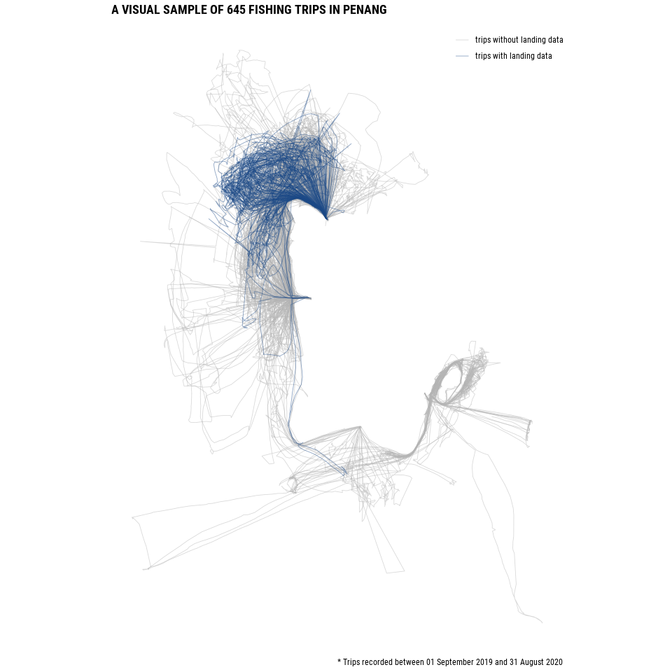
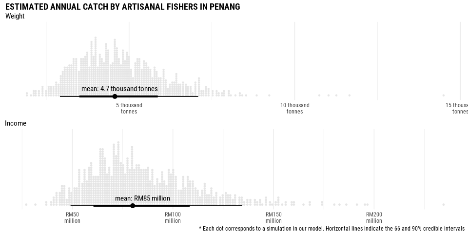
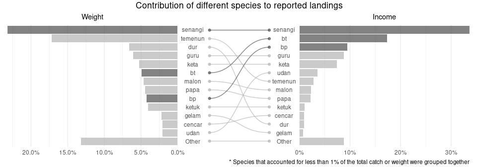
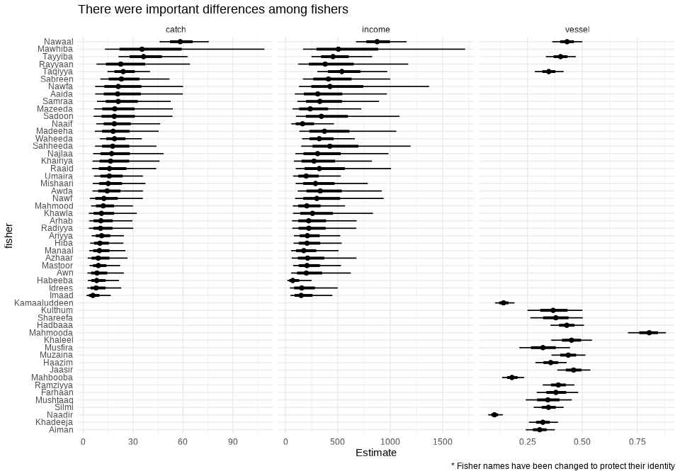
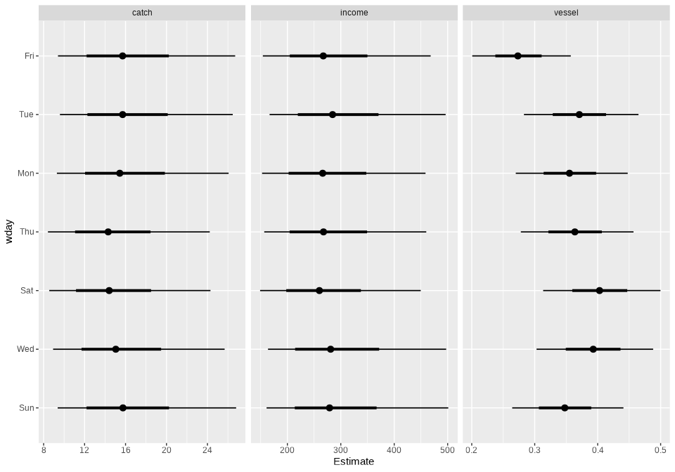
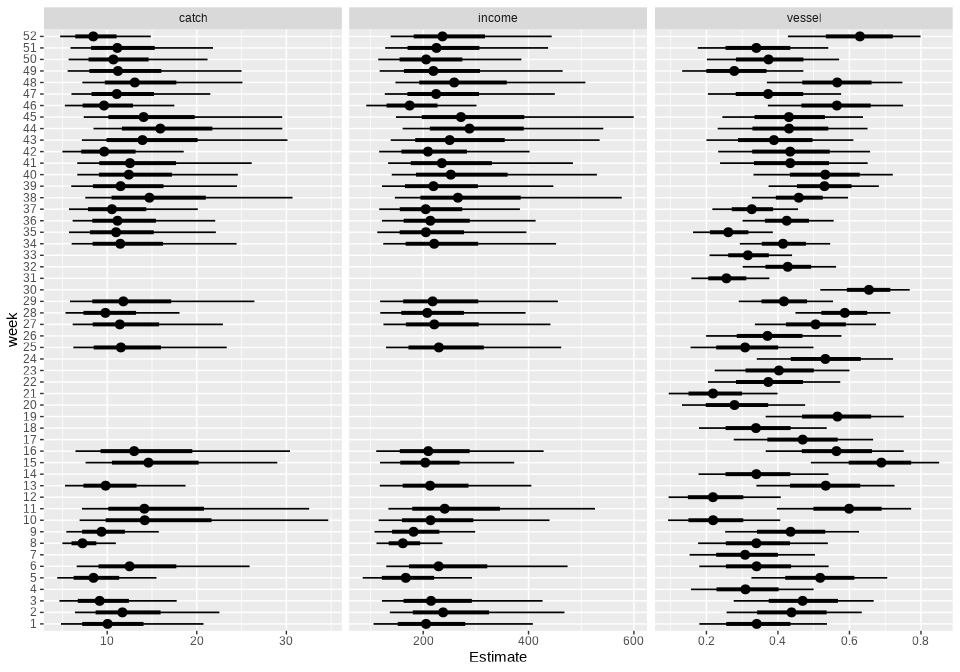

Penang fisheries
================

We report data collected between 01 September 2019 and 31 August 2020.
During this year we recorded information about 724 fishing trips in
Penang. The information about these trips was contributed by a total of
46 local fishers and is a combination of tracking and landings.

Up to 31 August 2020, WorldFish installed solar-powered GPS trackers
sourced from Pelagic Data Systems Inc. in 14 boats at four key landing
sites of Teluk Bahang, Balik Pulau, Seagate and Kuala Binjai. Most of
the trackers were installed in July or August 2020, but three of them
were installed in September or November 2019 which allow us to get a
better picture of their activity across the year. Until 31 August 2020
these units tracked a total of 645 trips.

In addition to the tracking data, we also collected landings data. Data
collection was performed informally through a WhatsApp group set up with
participating fishers. In total, we collected landings information for
177 trips by 35 fishers.

Three of the fishers that contributed landings data also had a tracker
installed on their boats. Consequently we have both tracking and landing
data for 98 trips. Most of the landing data, however, comes from the
single most active fisher in the group. This fisher alone contributed
landing data for 95 trips which corresponds to about 62% of all their
fishing trips over the reporting period.

<!-- -->

## Catch weight and income

We are interested in calculating the total catch from artisanal
fisheries in Penang and the income it generates. We need four key
components to perform these calculations. First, we need to estimate the
expected catch weight from each trip. Second, we estimate the expected
income that the catch provides to artisanal fishers. Third, we need to
obtain an estimate of the vessel activity throughout the year. Fourth,
we need an estimate of the number of fishers in Penang.

We use hierarchical Bayesian models as the framework to estimate these
figures for four main reasons. First, Bayesian models perform
particularly well with relatively small amount of data. Second, a
hierarchical model allow us to minimise the biases that a arise from
unbalances in the contributed data; both across fishers and across time.
Third, using models, instead of simple averages allow us to obtain
estimates of the catch even for periods for which we have no
comprehensive sampling. Lastly, and most importantly, a Bayesian
framework allow us, not only to obtain an estimate of the numbers we are
interested on, but also allow us to better understand the uncertainties
involved in the calculation.

First, we look at the expected catch weight from a single trip. There
was a lot of variability in the catch weight with some trips fishing as
little as 0.4kg and some as much as 200kg. Nevertheless, using ten
thousand Monte Carlo simulations in our Bayesian models, we found that
the average catch was very likely between 10kg and 23.7kg (90% credible
intervals, mean 15.9kg). The average catch showed important differences
among fishers, with some consistently landing more catch by weight than
the average. More data from a larger number of fishers will allow us to
better understand what drives these differences.

Second, we look at the expected income obtained from a fishing trip. We
found that each fishing trip was very likely to provide an income
between RM174 and RM443 (mean RM288) to artisanal fishers. Similar as
the catch weight, average income levels showed a large variation. Some
trips provided only RM0 as income for the fishers while some trips
provided as much as RM1884.

Third, we investigate the vessel activity coefficient during the study
period. We found that this coefficient was very likely to be between
0.36 and 0.54 (mean 0.45). Mathematically, this coefficient can be
interpreted in two (equivalent) ways. When applied to a single boat, it
can be interpreted as the probability that this boat would to a fishing
trip in a given day. When applied to a group of boats, for example the
Penang artisanal fishing fleet, it can be interpreted as the proportion
of boats that can be expected to be going on a trip in a given day.
Although some differences between fishers exist, the largest variations
were across time. Vessel activity appeared to be lessened during Fridays
and Sundays and in some particular weeks of the year, presumably in
response to weahter events.

Lastly, we obtained the information about Penang’s fishing fleet based
on the number of active and registered fishers. In 2018 there were 1,658
fishers registered. This number might differ from the number of fishers
during the reporting period, but we expect the updated number to be
within 50 fishers from the 2018 number. We incorporate this uncertainty
in all estimates we present.

Using all these pieces of information we estimate that between the
period 01 September 2019 and 31 August 2020 **artisanal fishers were
very likely (90% probability) to catch between 2.9 and 7.3 thousand
tonnes in Penang waters, which provided income between RM49 and RM135
million to the local communities**.

<!-- -->

Although these wide ranges suggest a large uncertainty, it is actually a
remarkable achievement considering the limited amount of data used to
generate them. During the year we observe that the catch weight and
income stayed within the credible intervals of our estimates throughout
the years.

<!-- -->

A larger sample size, both for landings and tracking (which we use to
determine vessel activity) will allow us to detect smaller variations
across time and answer other questions to improve the management of the
fisheries and improve the livelihoods of artisanal fishers.

## Catch composition

We also looked at the catch composition in the trips where we recorded
data. Although composition data is, so far, biased and should not be
taken as indicative of Penang’s catch, we can already distinguish some
interesting patterns. *Text to be written once species/grade data is of
sufficient quality*.

<!-- -->

## Other unfinished plots

(not to be included in final document)

<!-- --><!-- --><!-- -->

<!-- -->

<!-- --> Between 01
September 2019 and 19 September 2020 we recorded landings for 187 trips
by 35 fishers.

During this time, GPS trackers were installed in 3 boats.

<!-- --><!-- -->
