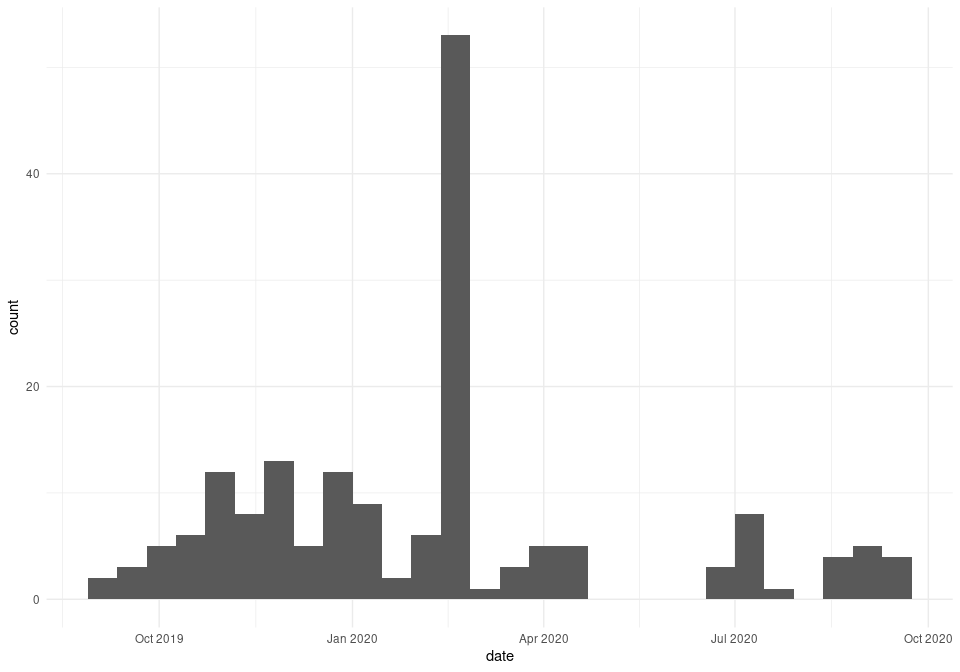
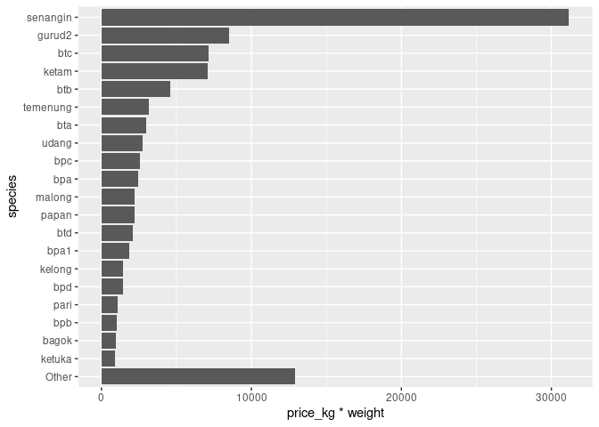
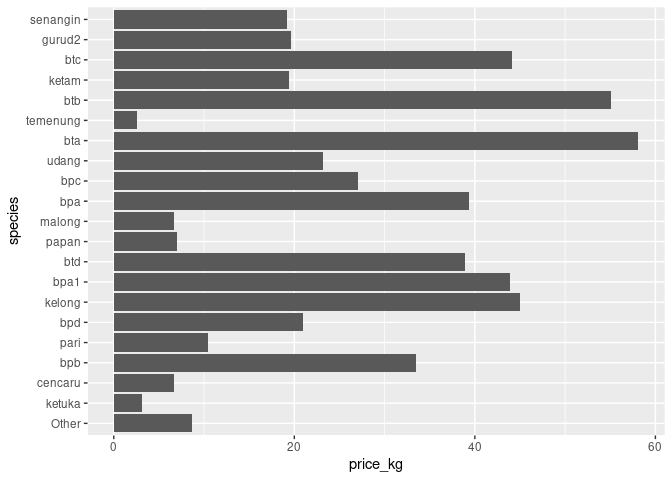
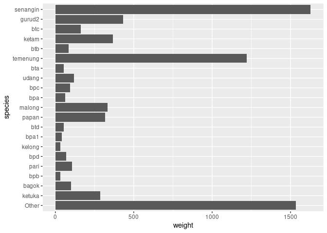
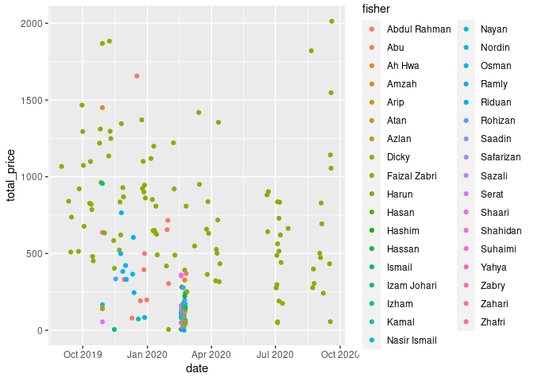

README
================

``` r
drake::loadd(landings_clean)
```

``` r
trip_summary <- landings_clean %>%
  dplyr::group_by(trip_id) %>%
  dplyr::summarise(
    date = dplyr::first(date), 
    fisher = dplyr::first(fisher), 
    total_price = sum(total_price), 
    weight_kg = sum(weight_kg),
    n_species = dplyr::n_distinct(species))

fisher_summary <- landings_clean %>%
  dplyr::group_by(fisher) %>%
  dplyr::summarise(
    imei = dplyr::first(imei),
    first_trip = min(date), 
    last_trip = max(date),
    total_price = sum(total_price), 
    weight_kg = sum(weight_kg),
    n_species = dplyr::n_distinct(species))
```

Between 01 September 2019 and 19 September 2020 we recorded 188 trips by
35 fishers. During this time, GPS trackers were installed in 3 boats.

``` r
trip_summary %>%
  ggplot(aes(x = date)) +
  geom_histogram(binwidth = 14, boundary = as.Date("2020-01-01")) +
  theme_minimal()
```

<!-- -->

``` r
fisher_summary %>%
  dplyr::mutate(fisher = forcats::fct_reorder(fisher, first_trip, .desc = TRUE)) %>%
  ggplot(aes(y = fisher)) +
  geom_segment(aes(x = first_trip, 
                   xend = last_trip, yend = fisher, colour = is.na(imei))) +
  geom_point(data = trip_summary, 
             aes(x = date), size = 1, shape = 3) +
  theme_minimal()
```

<!-- -->

``` r
species_summary <- landings_clean %>%
  dplyr::filter(!is.na(price_kg)) %>%
  dplyr::mutate(species = forcats::fct_lump_n(species, w = price_kg*weight_kg, n = 20)) %>%
  dplyr::group_by(species) %>%
  dplyr::summarise(
    frequency = dplyr::n_distinct(trip_id), 
    weight = sum(weight_kg, na.rm = TRUE), 
    price_kg = mean(price_kg, na.rm = TRUE)) %>%
  dplyr::mutate(species = forcats::fct_reorder(species, price_kg*weight), 
                species = forcats::fct_relevel(species, "Other"))
```

    ## `summarise()` ungrouping output (override with `.groups` argument)

``` r
species_summary %>%
  ggplot(aes(x = species, y = price_kg*weight)) +
  geom_col() +
  coord_flip()
```

<!-- -->

``` r
species_summary %>%
  ggplot(aes(x = species, y = price_kg)) +
  geom_col() +
  coord_flip()
```

<!-- -->

``` r
species_summary %>%
  ggplot(aes(x = species, y = weight)) +
  geom_col() +
  coord_flip()
```

<!-- -->

``` r
trip_summary %>%
  ggplot(aes(x = date, y = weight_kg)) +
  geom_point(aes(colour = fisher))
```

<!-- -->

``` r
trip_summary %>%
  ggplot(aes(x = date, y = total_price)) +
  geom_point(aes(colour = fisher))
```

    ## Warning: Removed 1 rows containing missing values (geom_point).

<!-- -->
