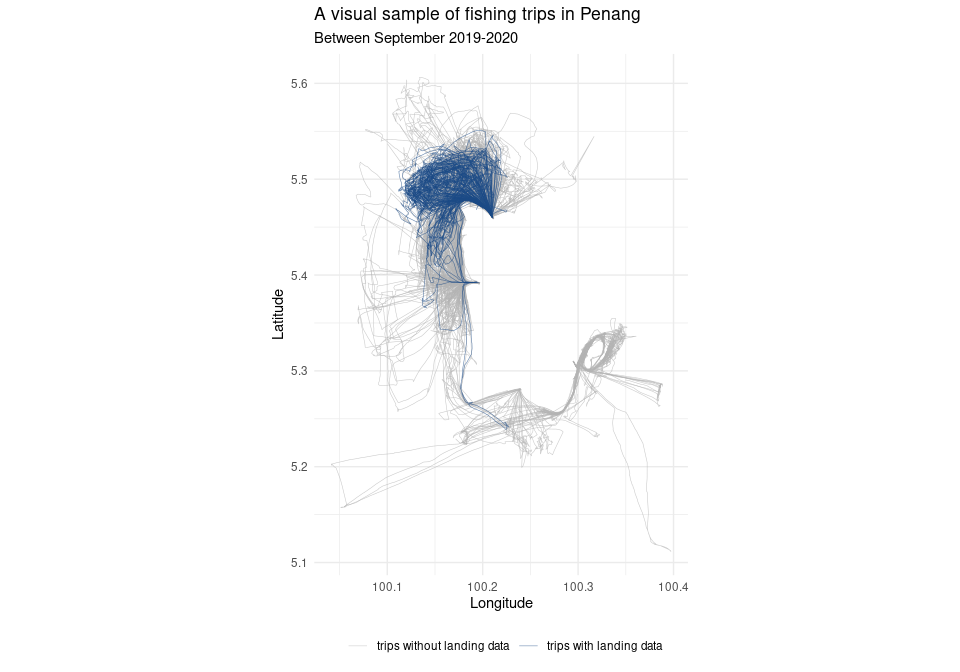
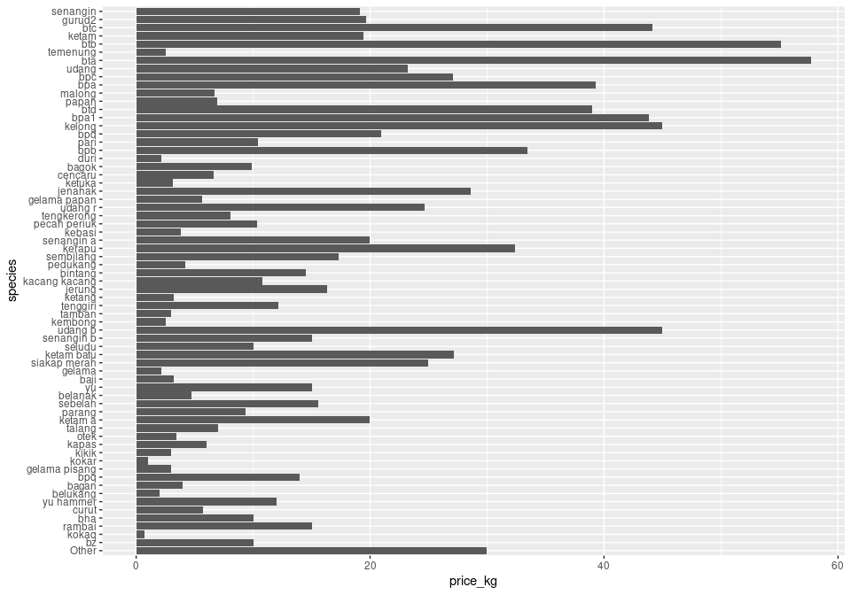
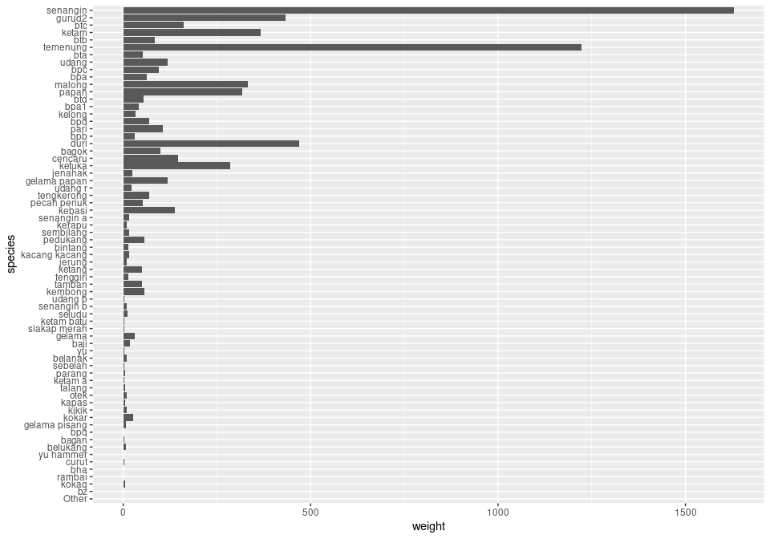
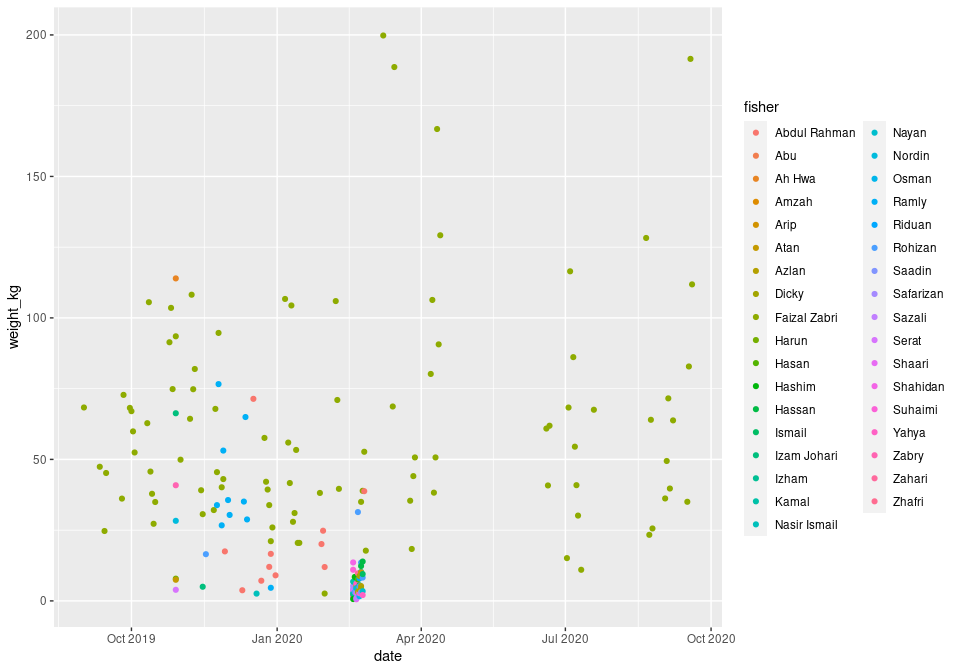
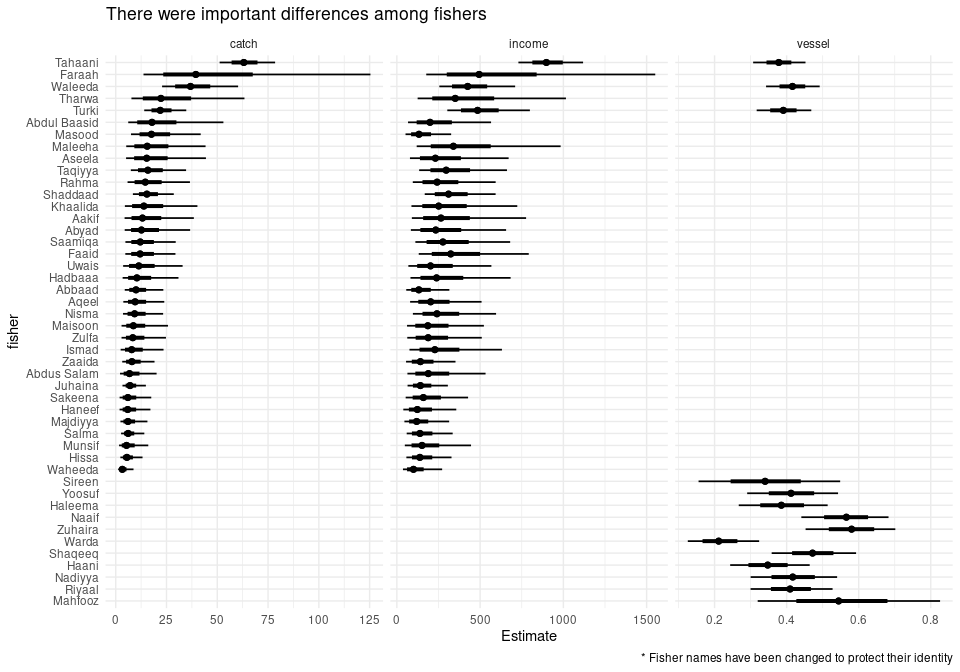
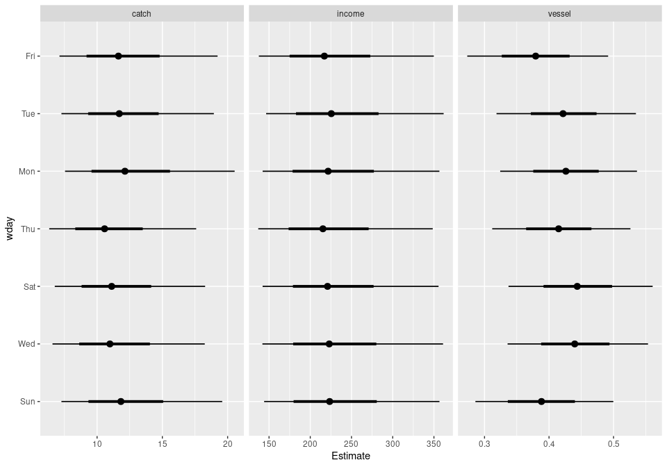

Penang fisheries
================

We report data collected between 01 September 2019 and 31 August 2020.
During this period we recorded information about 713 fishing trips in
Penang. The information about these trips was contributed by a total of
46 local fishers and is a combination of tracking and landings.

During the reporting period, WorldFish installed solar-powered GPS
trackers sourced from Pelagic Data Systems Inc. in 14 boats at four key
landing sites of Teluk Bahang, Balik Pulau, Seagate and Kuala Binjai.
Most of the trackers were installed in July or August 2020, but three of
them were installed in September or November 2019 which gives us a good
coverage over the last year for these boats. Until 31 August 2020 these
units tracked a total of 645 trips.

In addition to the boat tracks, we also collected landings data
informally through a WhatsApp group set up with participating fishers.
In total, we collected landings information for 166 trips by 35 fishers.

Three of these fishers have also a tracker installed on their boats and
consequently we have both tracking and landing data for 98 trips. Most
of this landing data, however, comes from the most active fisher. This
fisher alone contributed landing data for 87 trips which corresponds to
about 60% of all their fishing trips over the reporting period.

<!-- -->

We are interested in calculating the total catch from artisanal
fisheries in Penang and the income it generates. We need three key
components to perform these calculations. First, we need to estimate the
expected catch weight from each trip and the income it generates.
Second, we need to obtain an estimate of the vessel activity throughout
the year. Third, we need an estimate of the number of fishers in Penang.

We use hierarchical Bayesian models as the framework to estimate these
figures for four main reasons. First, Bayesian models perform
particularly well with relatively small amount of data. Second, a
hierarchical model allow us to minimise the biases that a arise from
unbalances in the contributed data; both across fishers and across time.
Third, using models, instead of simple averages allow us to obtain
estimates of the catch even for periods for which we have no
comprehensive sampling. Lastly, and most importantly, a Bayesian
framework allow us, not only to obtain an estimate of the numbers we are
interested on, but also allow us to better understand the uncertainties
involved in the calculation.

First, we look at the expected catch weight from a single trip. There
was a lot of variability in the catch weight with some trips fishing as
little as 0.6kg and some as much as 200kg. Nevertheless, using ten
thousand Monte Carlo simulations, we found that the average catch was
somewhere between 7.1kg and 18.5kg (95% credible intervals) with a mean
of 11.8kg. The average catch showed important differences among fishers,
with some consistently landing more catch by weight than the average.
More data from different fishers will allow us to better understand what
drives these differences.

That catch represented an average income per trip between RM143 and
RM351 (mean RM228). Similar as the catch weight, average income levels
showed a large variation among fishers and trips. Some trips provided
only RM5 as income for the fishers while some trips provided as much as
RM1884.

We expect the vessel activity coefficient during the study period to be
between 0.31 and 0.52 (mean 0.42). Mathematically, this coefficient can
be interpreted in two equivalent ways. When applied to a single boat, it
can be interpreted as the probability that this boat would to a fishing
trip in a given day. When applied to a group of boats, for example the
Penang artisanal fishing fleet, it can be interpreted as the proportion
of boats that can be expected to be going on a trip in a given day.
Although some differences between fishers exist, the largest variations
were across time with some weeks being more .

<!-- -->

Using all these pieces of information we estimate that between the
period 01 September 2019 and 31 August 2020 **artisanal fishers were
very likely (95% probability) to catch between 1.8 and 5.1 thousand
tonnes in Penang waters, which provided income between RM36 and RM97
million to the local communities**.

<!-- -->

## Landings

Between 01 September 2019 and 19 September 2020 we recorded landings for
175 trips by 35 fishers.

During this time, GPS trackers were installed in 3 boats.

<!-- -->

<!-- -->

<!-- --><!-- --><!-- -->

<!-- --><!-- -->

<!-- --><!-- --><!-- -->
